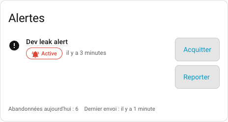
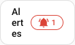
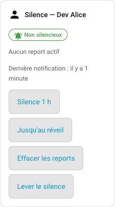
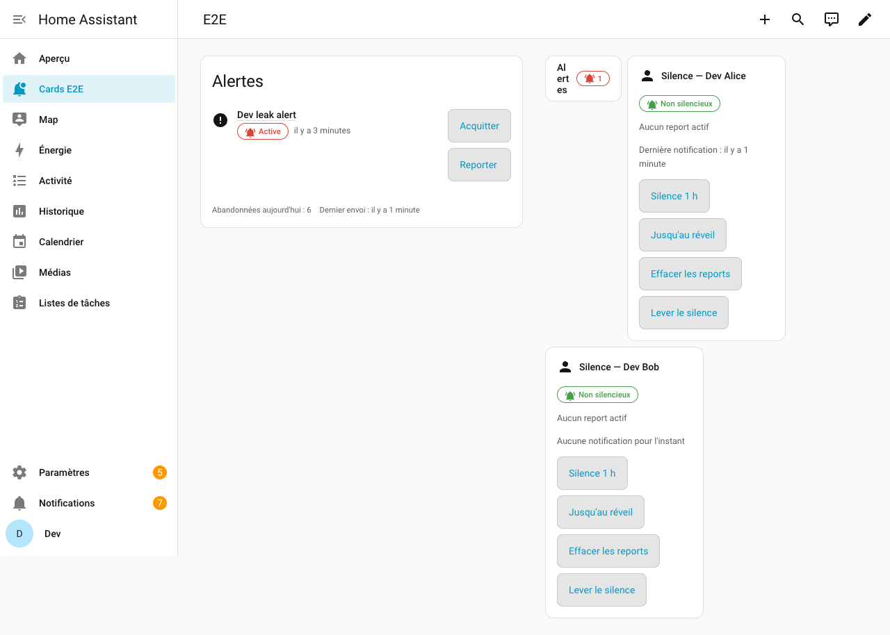
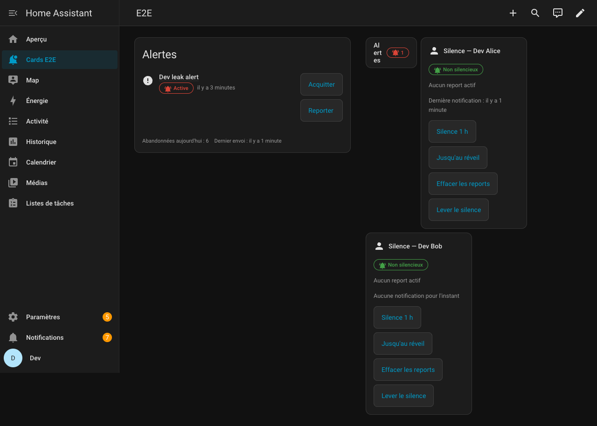
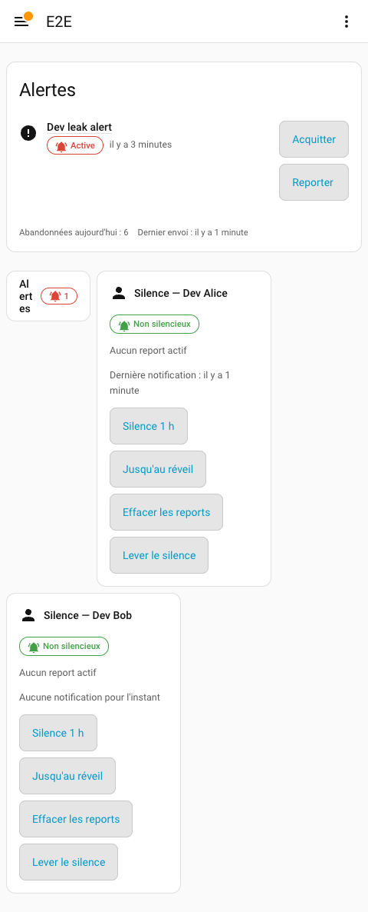

# Notify Switchboard Cards

Lovelace custom cards for [Notify Switchboard](https://github.com/amiel-35/notify-switchboard),
the Home Assistant integration that routes the core `alert` integration's
notifications per person. These cards are the "consumption" side: they read
and act on `alert.*` entities and the router's own entities/services, and
degrade gracefully wherever the router does not (yet) expose a feature.

Two cards are included:

- **`switchboard-alerts-card`** — lists `alert.*` entities, with
  acknowledge / un-acknowledge / snooze actions. Can render inline (`full`)
  or as a compact badge that opens a dialog (`compact`).
- **`switchboard-silence-tile`** — shows one person's silence state
  (`binary_sensor.<person>_silenced`, active snoozes, last notification)
  with silence / clear controls.

## Screenshots

| | |
|---|---|
|  | `switchboard-alerts-card`, `mode: full`, with one active alert |
|  | `switchboard-alerts-card`, `mode: compact` |
|  | `switchboard-silence-tile` for a person with no active silence |
|  | Full dashboard — light theme |
|  | Full dashboard — dark theme |
|  | Full dashboard — mobile viewport (480px) |

Captured against a real Home Assistant 2026.9 instance with
`scripts/screenshots.mjs` (see [CONTRIBUTING.md](CONTRIBUTING.md)).

> **Note:** these cards (currently 0.2.0) target [Notify Switchboard](https://github.com/amiel-35/notify-switchboard) 0.7.0 and degrade gracefully against any earlier router release. See the [Router version matrix](#router-version-matrix) below for exactly what each router version unlocks — from 0.7.0 the cards derive `target_map`, `snooze_minutes` and `wake_time` from the router itself; below 0.2, the silence tile's buttons stay disabled (with an explanation) and the snooze menu is hidden, and acknowledging falls back to `alert.turn_off`.

## Compatibility

These cards read native `alert.*` entities and the per-person router
entities documented in the
[Notify Switchboard contract](https://github.com/amiel-35/notify-switchboard/blob/main/docs/contract.md):
`binary_sensor.<person>_silenced`, `sensor.<person>_active_snoozes` and
`sensor.<person>_last_notification`.

The alerts card additionally shows a small "today" footer when the
instance-wide entities `sensor.switchboard_dropped_today` and
`event.switchboard_delivery` exist. Neither is required: when they are
absent (or `unknown` / `unavailable`), the footer is simply not rendered.

Since router 0.7.0 both cards also read `sensor.switchboard_routing_table`
— the two closed attributes `targets` and `persons` — to derive options
the user used to have to restate in YAML. It is read defensively: a
missing, `unavailable` or malformed entity simply derives nothing, and the
cards behave exactly as they did in 0.1.x.

The router's dedicated services (`notify_switchboard.acknowledge`,
`snooze`, `silence`, `unsnooze`, `unsilence`) shipped in Notify
Switchboard 0.2.0. **Every action in these cards checks `hass.services`
before calling one of those services and falls back to the native
`alert.turn_off` / `alert.turn_on` actions, or marks itself `aria-disabled`
with a visible "Requires Notify Switchboard ≥ 0.2.0" line, when the service
is not present.** Nothing in these cards requires router 0.2.0 or later to
be usable — see the matrix below for the full picture.

## Router version matrix

The cards read whatever the connected router version exposes and fall
back gracefully otherwise. This is the version at which each router
feature became available, and what it changes in these cards:

| Router version | What's available | What these cards do |
|---|---|---|
| 0.1.x | `alert.*` entities, `alert.turn_off` | Alerts card lists and acknowledges alerts via `alert.turn_off`. Silence tile renders, but every button is `aria-disabled` with a "Requires Notify Switchboard ≥ 0.2.0" hint — there is no dedicated service to call yet. |
| 0.2.x | `notify_switchboard.acknowledge` / `snooze` / `unsnooze` / `silence` / `unsilence` services | Acknowledge and the snooze menu use the dedicated services instead of the `alert.turn_off` fallback; the silence tile's four buttons become active. |
| 0.3.x | Translated entity names, frozen entity ids: `binary_sensor.<person>_silenced`, `sensor.<person>_active_snoozes`, `sensor.switchboard_deferred_today` | No visible change — the cards already target these ids; 0.3 just guarantees they won't move. |
| 0.4.x | `notify_switchboard.explain` response service | No effect on these cards; neither card calls `explain` yet. |
| 0.5.x | Wake-time summary notifications (tagged `switchboard-summary`), episode `done` filtering | No effect on these cards; they read entity/alert state, not notification content. |
| 0.6.x | Five-field target editor, one vocabulary | No effect on these cards; the entity and service surface they read is unchanged. |
| 0.7.0 | `sensor.switchboard_routing_table`; `acknowledged` event payload with `user_id` / `person` | **`target_map`, `snooze_minutes` and `wake_time` become optional**: the cards derive each alert's slug, each target's own snooze durations and `allow_acknowledge`, and each person's wake time from the routing table. The alerts card shows "Acknowledged by …" for the last acknowledgement, and the kiosk person picker (`person_picker: true`) can offer the router's persons. |

Below router 0.7.0 there is no routing table to read, so `target_map`,
`snooze_minutes` and `wake_time` stay in the card config exactly as
before, and neither "Acknowledged by …" nor the person picker appears.
Setting those options against a 0.7.0 router is still legitimate: they
are overrides, and they win.

## Installation

### HACS (recommended)

1. In Home Assistant, open **HACS → Dashboard**, then the **⋮** menu →
   **Custom repositories**.
2. Add `https://github.com/amiel-35/notify-switchboard-cards`, category
   **Dashboard**.
3. Find **Notify Switchboard Cards** in HACS, click **Download**.
4. Add the resource if HACS did not do it automatically: **Settings →
   Dashboards → ⋮ → Resources** →
   `/hacsfiles/notify-switchboard-cards/notify-switchboard-cards.js`,
   type **JavaScript Module**.

### Manual

1. Download `notify-switchboard-cards.js` from the
   [latest release](https://github.com/amiel-35/notify-switchboard-cards/releases/latest).
2. Copy it to `<config>/www/notify-switchboard-cards.js`.
3. Add the resource: **Settings → Dashboards → ⋮ → Resources** →
   `/local/notify-switchboard-cards.js`, type **JavaScript Module**.

## Usage

### `switchboard-alerts-card`

```yaml
type: custom:switchboard-alerts-card
title: Alerts
mode: full # or "compact"
show_acknowledged: true
entities:
  - alert.leak_kitchen
  - alert.door_left_open
# Every option below is optional against router 0.7.0 and later.
target_map:
  alert.leak_kitchen: leak
snooze_minutes: [15, 60, 480]
person: person.alice
person_picker: false
```

- `entities` — list of `alert.*` entity ids. Defaults to every `alert.*`
  entity in Home Assistant when omitted.
- `mode` — `full` renders the list inline; `compact` renders a badge with
  the active/acknowledged/unavailable counts that opens a dialog on
  activation. In compact mode the badge shows **chips only** by default —
  `title` is not rendered on the badge itself unless explicitly
  configured, since a narrow sections column rarely has room for both a
  title and the count chips. When `title` is set, it is shown as a
  single, non-wrapping line (ellipsized if the column is too narrow) so
  it can never wrap letter by letter; the dialog opened from the badge
  always shows the title regardless of this setting.
- `show_acknowledged` — whether acknowledged (`off`-state) alerts are
  listed alongside active ones. Idle alerts are never listed; unavailable
  ones always are.
- `target_map` — **optional since router 0.7.0.** Maps an `alert.*` entity
  to its Notify Switchboard target slug (the `notify.switchboard_<slug>`
  row), so Acknowledge can call `notify_switchboard.acknowledge` and the
  Snooze menu can appear. From router 0.7.0 the card reads that mapping
  out of `sensor.switchboard_routing_table` (each target's
  `alert_entity`), so you only need this option to override the router or
  to map an alert it does not own. Without a mapping from either source,
  Acknowledge falls back to `alert.turn_off` and Snooze never appears for
  that entity.
- `snooze_minutes` — **optional since router 0.7.0.** Durations (positive
  whole minutes) offered in the snooze menu. Left unset, each target's own
  `snooze_minutes` from the routing table is used, falling back to
  `[15, 60, 480]` when the router publishes none. Set, it applies to every
  target on the card.
- `person` — optional `person.*` entity the snooze applies to. **Without
  it, `notify_switchboard.snooze` snoozes the target for the whole
  audience**, and the menu says so ("Snooze for everyone · 15 min").
- `person_picker` — `true` turns Snooze into two steps on the card
  itself: who, then how long. The chooser lists the persons the routing
  table publishes (named from their `person.*` state) plus an explicit
  "Everyone", and what you pick is the `person` passed to
  `notify_switchboard.snooze` for that one call — it overrides the
  `person` option and is forgotten when the menu closes. Intended for a
  shared wall tablet, where the card has no idea who is standing in front
  of it. Acknowledge never asks: the router reads the acting user from the
  call's own context. Defaults to `false`, and never appears when the
  routing table names nobody (router below 0.7.0 included).

Every option is validated in `setConfig`: a bad shape (for instance
`entities: alert.leak` as a bare string, or `mode: tiny`) produces a
Lovelace error card naming the offending option rather than a card that
renders wrong or throws mid-render.

Alert entities in `unavailable` or `unknown` are shown as a distinct
fourth state — a neutral "Unavailable" chip with a `mdi:help-circle-outline`
icon and no actions. They are never counted or styled as acknowledged.

An acknowledged alert also shows **"Acknowledged by …"** when the router
(0.7.0 and later) says who did it. Authorship lives in the `acknowledged`
payload of `event.switchboard_delivery` and nowhere else — no sensor, no
stored record — and a Home Assistant event entity keeps only its **last**
event. So the line is shown while the last delivery event is this target's
acknowledgement, and disappears as soon as any later routing event
replaces it. When the router could not resolve the acting user to a
`person.*`, a shortened user id is shown rather than a guess; when it
knows neither, nothing is shown.

Clicking an alert's name opens Home Assistant's more-info dialog for it.

### `switchboard-silence-tile`

```yaml
type: custom:switchboard-silence-tile
person: person.alice
wake_time: "07:00"
title: Alice
```

- `person` — a `person.*` entity. The tile derives
  `binary_sensor.<object_id>_silenced`, `sensor.<object_id>_active_snoozes`
  and `sensor.<object_id>_last_notification` from it.
- `wake_time` — **optional since router 0.7.0.** 24h `HH:MM`, used by
  "Until wake" to compute how many minutes to silence for. Left unset, the
  tile reads this person's own `wake_time` from
  `sensor.switchboard_routing_table` (the router publishes it as
  `HH:MM:SS`), falling back to `07:00` when neither is available. Computed
  on the **Home Assistant instance's** clock (`hass.config.time_zone`),
  not the browser's.

The tile's four controls map one-to-one onto router services: "Silence 1 h"
and "Until wake" call `notify_switchboard.silence`, "Clear snoozes" calls
`notify_switchboard.unsnooze`, and "Lift silence" calls
`notify_switchboard.unsilence`. No call is synthesised out of another
service.

## Accessibility

Both cards keep every interactive control at a 48px minimum touch target,
show a visible focus outline, expose `aria-label`s, wrap text instead of
truncating it (verified at 200% browser zoom), never rely on color alone
for state (every chip carries text *and* an icon), and skip non-essential
motion when `prefers-reduced-motion: reduce` is set.

The compact badge's dialog traps focus: Tab and Shift+Tab cycle inside it,
and Escape closes it and returns focus to the badge button. Controls that
cannot act (because the router service is missing) are `aria-disabled`
rather than `disabled`, so they stay reachable and the reason is announced.


## Development

```bash
npm install
npm run dev        # rebuilds dist/notify-switchboard-cards.js on change
npm run lint
npm run format:check
npm run typecheck
npm test
npm run build       # dist/notify-switchboard-cards.js (+ .js.map)
npm run size        # bundle size budget check (<= 60 kB gzip)
```

See [CONTRIBUTING.md](CONTRIBUTING.md) for the full workflow.

## License

[MIT](LICENSE) © 2026 Amiel Lavon
